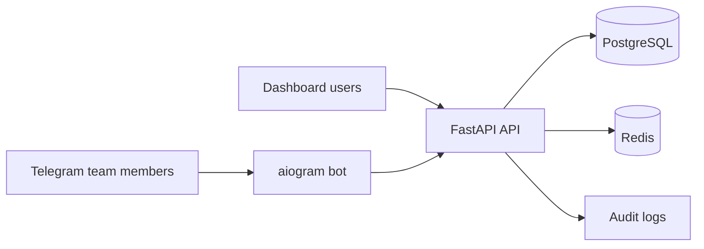

# FinMate UZ

FinMate UZ is a Telegram-first cash flow management SaaS for small and medium businesses in Uzbekistan. Teams log income and expenses through a Telegram bot using natural text or voice, while owners and managers monitor finances from a company-scoped web dashboard.

## Problem

Many Uzbek SMBs track money in Telegram chats, notebooks, spreadsheets, or informal cashier messages. That makes cash flow hard to trust: records are scattered, approval state is unclear, and reports can mix data across teams.

## Solution

FinMate UZ keeps Telegram as the fast input channel and centralizes finance data in a secure backend with company isolation, RBAC, audit logs, soft deletes, approval flow, and dashboard analytics.



## Features

- Multi-company SaaS model with strict `company_id` isolation.
- Roles: owner, manager, accountant, operator, viewer.
- JWT access/refresh token auth.
- Default Uzbek SMB income and expense categories.
- Transaction create/list/filter/search/update/soft-delete.
- Approval flow for operator-created pending transactions.
- Audit logs for transaction/category changes and login events where practical.
- Reports from confirmed transactions by default, with explicit pending inclusion.
- Telegram account linking with short-lived `/link <code>` commands.
- Uzbek Latin transaction/report/edit/delete parser with follow-up handling.
- Voice-message transcriber adapter with a local mock provider.
- Next.js dashboard: login, register, onboarding, overview, transactions, analytics, categories, settings.
- Docker Compose for local and production-style deployments.
- GitHub Actions CI and gated production deploy workflow.

## Tech Stack

- Backend: FastAPI, SQLAlchemy 2.x, Alembic, Pydantic, PostgreSQL.
- Bot: aiogram 3.x, typed backend gateway, transcriber adapter.
- Web: Next.js App Router, TypeScript, Tailwind CSS, TanStack Query, Recharts.
- Infra: Docker Compose, Redis.
- Testing: pytest, pytest-asyncio, FastAPI TestClient, Vitest, Testing Library.

## Monorepo

```text
apps/api  FastAPI API, database models, migrations, services, tests
apps/bot  Telegram bot, parsers, handlers, conversation services, tests
apps/web  Dashboard UI, typed API client, feature modules, tests
docs      Architecture, API, bot flows, security, testing, deployment
infra     Local infrastructure notes
```

## Local Setup

```bash
cp .env.example .env
make up
```

Open:

- API docs: `http://localhost:8000/docs`
- API health: `http://localhost:8000/health`
- Web dashboard: `http://localhost:3000`

Create the first production-like local account from `/register`. The app does not ship seeded demo users by default.

## Useful Commands

```bash
make up          # start local stack
make down        # stop local stack
make prod-up     # start production-style stack from docker-compose.prod.yml
make prod-down   # stop production-style stack
make prod-logs   # follow production stack logs
make prod-ps     # show production stack containers
make prod-restart
make prod-deploy # run scripts/deploy-production.sh
make migrate     # run Alembic migrations in API container
make api-test    # backend tests
make bot-test    # bot tests
make web-test    # lint + typecheck + web tests
make web-build   # production web build
make checks      # all practical checks
```

Manual app commands:

```bash
cd apps/api && python -m pytest
cd apps/bot && python -m pytest
cd apps/web && npm run lint && npm run typecheck && npm run test && npm run build
```

## Bot Examples

- `bugun 250 ming logistika uchun ketdi`
- `kecha 1 million 200 ming tushdi sayt uchun`
- `50 ming ketdi`
- `bu oy qancha xarajat qildik?`
- `logistikaga qancha ketdi?`
- `oxirgisini o‘chir`
- `oxirgisini 90 ming qil`

Telegram users must be linked from dashboard Settings before they can create or query company data.

## Dashboard Pages

- `/login`
- `/register`
- `/onboarding`
- `/dashboard/overview`
- `/dashboard/transactions`
- `/dashboard/analytics`
- `/dashboard/categories`
- `/dashboard/settings`

The dashboard uses UZS formatting such as `1 250 000 so‘m`, clear positive/negative cash-flow states, empty-state guidance, and source/status badges.

## CI/CD

GitHub Actions are included:

- `.github/workflows/ci.yml`: API tests, bot tests, web lint/typecheck/tests/build, Docker Compose config validation.
- `.github/workflows/deploy-production.yml`: gated SSH deployment for a VPS-style Docker Compose host.

Production deploy is disabled until repository variable `PRODUCTION_DEPLOY_ENABLED=true` and these secrets are configured:

- `PRODUCTION_HOST`
- `PRODUCTION_USER`
- `PRODUCTION_SSH_KEY`

The production server should keep real environment values in `/opt/finmateuz/.env` or the configured deploy directory. Do not commit `.env`.

## Security Summary

- Every company-scoped API request requires a valid JWT and `X-Company-Id`.
- Services enforce tenant isolation, not only routers.
- Viewer is read-only.
- Operators create pending transactions and can only edit/delete their own pending records.
- Confirmed financial records use soft delete.
- Reports include confirmed transactions by default.
- Telegram bot calls use an internal `BOT_API_TOKEN` and linked Telegram accounts.
- Real secrets must be provided via environment variables and never committed.

See [SECURITY.md](SECURITY.md) and [docs/SECURITY.md](docs/SECURITY.md).

## Production Deployment

Production URLs:

- Dashboard: `https://app.finmates.app`
- API: `https://api.finmates.app`
- Root redirect: `https://finmates.app` -> `https://app.finmates.app`

See [docs/DEPLOYMENT.md](docs/DEPLOYMENT.md). Minimum production steps:

1. Create `.env` on the server from `.env.example` or your private server template, then replace every secret and production URL.
2. Set `ENVIRONMENT=production`.
3. Point `DATABASE_URL`, `REDIS_URL`, `CORS_ORIGINS`, `API_BASE_URL`, and `NEXT_PUBLIC_API_URL` to production resources/domains.
4. Run `docker compose -f docker-compose.prod.yml up --build -d`.
5. Confirm `/health`, web login/register, Telegram `/link`, and a transaction create flow.

## Roadmap

- Refresh-token persistence and revocation.
- Member management UI and invite flow.
- Web success/error toast system.
- Real speech-to-text provider adapter.
- CSV/XLSX report exports.
- Playwright smoke tests for dashboard auth and transaction flows.
