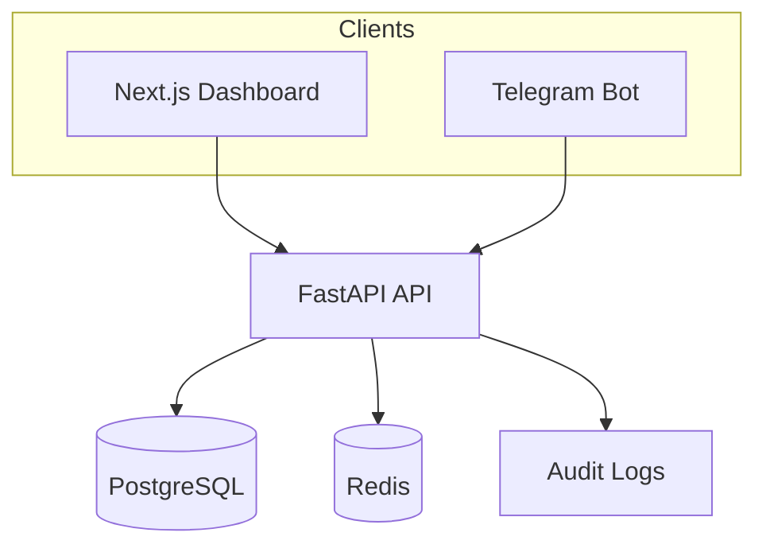

# Architecture

FinMate UZ is a monorepo with three applications and shared product rules centered in the backend API.



## Applications

- `apps/api`: FastAPI, SQLAlchemy 2.x, Alembic, Pydantic, tests.
- `apps/bot`: aiogram 3.x, parser modules, conversation service, backend gateway.
- `apps/web`: Next.js App Router, TypeScript, Tailwind, TanStack Query, Recharts.

## Backend Layers

```text
app/core       config and security helpers
app/db         SQLAlchemy base, engine, session dependency
app/models     database entities
app/schemas    Pydantic DTOs
app/services   business rules and queries
app/api/routes FastAPI routers
app/tests      pytest suite
```

Routers are thin. Services enforce RBAC, company isolation, approval flow, report inclusion rules, and audit logging.

## Core Data Model

- `users`
- `companies`
- `company_members`
- `categories`
- `transactions`
- `audit_logs`
- `telegram_accounts`

## Transaction Lifecycle

1. Owner/manager/accountant creates a confirmed transaction.
2. Operator creates a pending transaction.
3. Owner/manager/accountant approves or rejects pending transactions.
4. Deletes are soft deletes with `status=deleted`.
5. Reports include confirmed transactions by default.

## Bot Flow

The bot parses natural Uzbek text/voice into intents/entities, stores incomplete drafts in conversation state, and sends final create/update/delete/report requests to the backend API. Financial validation remains backend-owned.

## Web Flow

The dashboard uses a typed API client and TanStack Query. Authenticated dashboard routes require a JWT and selected company id in browser storage. API failures are shown as loading/error/empty states instead of silently falling back to fake production data.
